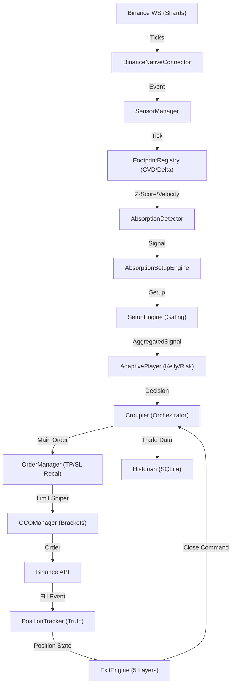

# 🗺️ Mapa Arquitectónico: Casino-V3 (Absorption V2.1)

Este documento representa el "Mapa Mental" del agente sobre la estructura actual del bot tras el pivot de LTA a Absorción. Es la base para la reunión de rediseño drástico.

## 🔄 El Pipeline de Ejecución (End-to-End)

## 🧩 Estado de los Componentes (Análisis de Deuda Técnica)

| Componente | Origen | Estado Actual | Riesgo / Deuda |
|------------|--------|---------------|----------------|
| **SetupEngine** | LTA | Híbrido | Contiene lógica de "Location Gate" y "Guardianes" de LTA que pueden estar bloqueando la Absorción. |
| **Croupier** | Legacy | "God Object" | Demasiada responsabilidad. Maneja desde el escalado hasta la contabilidad de fees. Muy difícil de debuguear. |
| **ExitEngine** | Phase 1200 | Robusto | Puede ser "sobre-protector". La lógica de Thesis Invalidation podría estar cerrando trades ganadores prematuramente. |
| **FootprintRegistry** | New (Abs) | Excelente | Es el componente más limpio y rápido. 0.1ms de latencia. |
| **OCOManager** | Legacy | Complejo | La gestión de órdenes limit con offset (Limit Sniper) añade una capa de fragilidad en el timing de Binance. |

## ⚠️ Puntos de Fricción Identificados
1.  **Interferencia de Capas**: El bot todavía intenta pensar en niveles de LTA (VAH/VAL) mientras busca señales de micro-absorción. Esto crea el "bloqueo de frecuencia" que vimos en SOL.
2.  **Asincronía en TP/SL**: Recalcular el TP justo antes de enviar la orden (Limit Sniper) es potente pero peligroso si el tick del footprint llega con retraso.
3.  **Contabilidad de Fees**: La lógica de `VirtualExchange` para simular comisiones de Maker/Taker es un parche sobre el motor de backtest original.

## 🎯 Próximo Paso (Reunión de Developers)
*   **Pregunta Clave**: ¿Debemos amputar definitivamente la lógica de LTA del `SetupEngine` para que el bot sea 100% "Absorption-First"?
*   **Propuesta**: Modularizar el `Croupier` en micro-servicios (Accountant, Executioner, Monitor).
