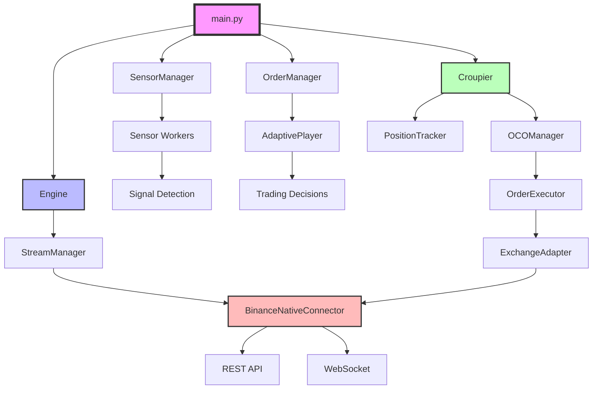
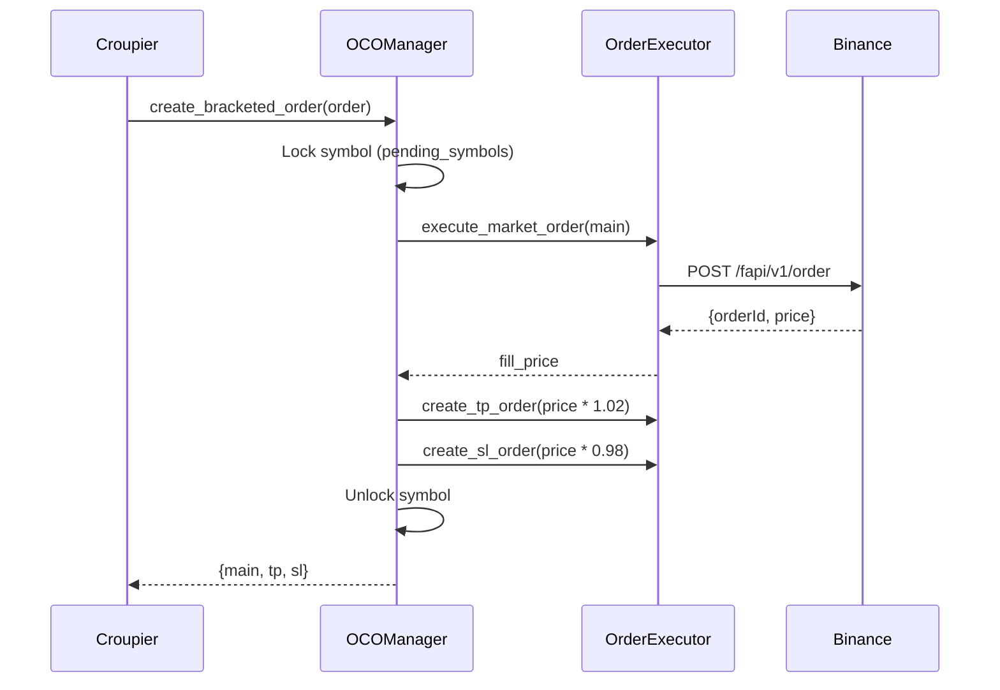
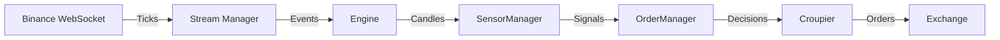
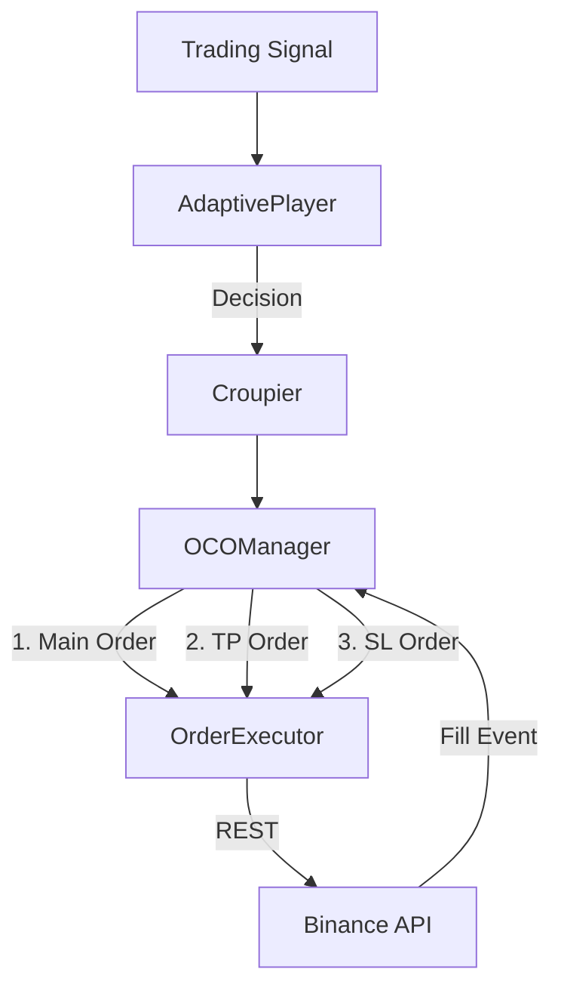
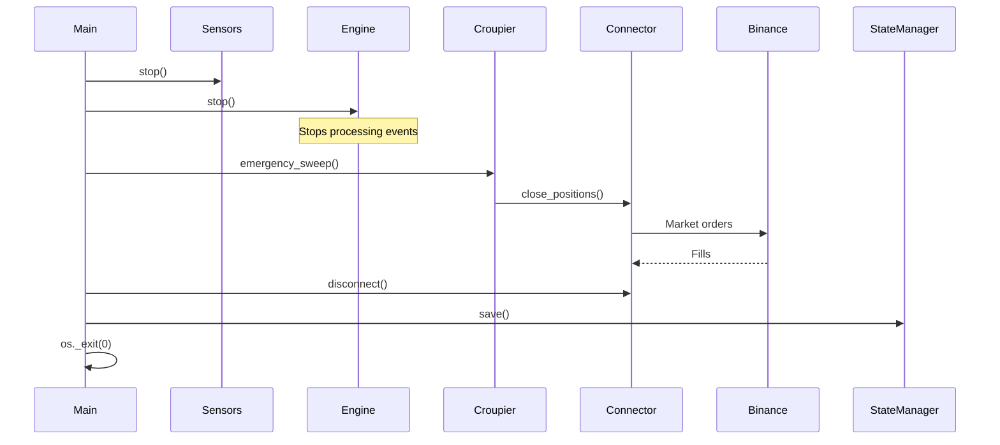

# Architecture Documentation 🏗️

This document describes the system architecture and design decisions of Casino-V3.

---

## System Overview

Casino-V3 is an **event-driven, async-first algorithmic trading bot** built for high-frequency cryptocurrency futures trading.

### Design Principles

1. **Async-First**: All I/O operations use `asyncio` for non-blocking concurrent execution
2. **Event-Driven**: Components communicate via events, not direct calls
3. **Fail-Safe**: Circuit breakers, retries, and graceful degradation at every level
4. **Observable**: Comprehensive metrics, logs, and state auditing
5. **Recoverable**: Automatic state persistence and crash recovery

---

## High-Level Architecture



---

## Core Components

### 1. Main Orchestrator (`main.py`)

**Responsibility**: Application lifecycle management

**Key Functions**:
- Initialize all components
- Setup signal handlers (SIGTERM, SIGUSR2)
- Manage shutdown sequence
- Generate session reports

**Lifecycle**:
```
Start → Initialize → Run → [Timeout/Signal] → Shutdown → Exit
```

---

### 2. Engine (`core/engine.py`)

**Responsibility**: Event processing and distribution

**Components**:
- Event loop for market data
- Strategy execution coordinator
- Stream management delegation

**Event Flow**:
```
WebSocket Tick → Engine → Process Event → Dispatch to Strategies
```

---

### 3. SensorManager (`core/sensors/sensor_manager.py`)

**Responsibility**: Parallel signal detection across timeframes

**Architecture**:
- Multiprocessing pool of sensor workers
- IPC via queues for candle data
- Aggregates signals from 50+ indicators

**Signal Processing**:
```
Candle Close → Workers (4 processes) → Compute Indicators → Emit Signals
```

---

### 4. OrderManager (`core/execution.py`)

**Responsibility**: Trading decision execution

**Flow**:
```
Signal → AdaptivePlayer → Decision → Croupier → Order Execution
```

**Decision Logic**:
- Weighted consensus from multiple sensors
- HTF (Higher Timeframe) trend filtering
- Conviction thresholds and debouncing

---

### 5. Croupier (`croupier/croupier.py`)

**Responsibility**: Portfolio orchestration

**Sub-Components**:
- **OCOManager**: Bracket order (Entry + TP + SL) creation
- **PositionTracker**: Active position monitoring and P&L tracking
- **OrderExecutor**: Low-level order placement

**OCO Creation Flow**:


---

### 6. ExchangeAdapter (`exchanges/adapters/exchange_adapter.py`)

**Responsibility**: Exchange-agnostic trading interface

**Key Methods**:
- `get_current_price(symbol)` - Fetch ticker
- `create_order(...)` - Place order
- `fetch_balance()` - Get account balance
- `fetch_positions()` - Get open positions

**Error Handling**:
- Automatic retry with exponential backoff
- Circuit breaker integration
- Error classification (retriable vs fatal)

---

### 7. BinanceNativeConnector (`exchanges/connectors/binance/binance_native_connector.py`)

**Responsibility**: Direct Binance API integration

**Features**:
- **WebSocket-First**: Real-time market data and user updates
- **Bulk Optimizations**: Batch ticker fetching (1 weight for all symbols)
- **Rate Limiting**: Intelligent throttling per endpoint type
- **Circuit Breakers**: REST failover to WebSocket cache

**Request Flow**:
```
Request → RateLimiter.acquire() → ErrorHandler → REST API → Response
         ↓ (if breaker open)
         WebSocket Cache
```

---

## Data Flow

### Market Data Pipeline



### Order Execution Pipeline



---

## Resilience Architecture

### 1. Circuit Breakers

**Purpose**: Prevent cascading failures during service degradation

**States**:
- **CLOSED**: Normal operation
- **OPEN**: Service unavailable, fail fast
- **HALF_OPEN**: Testing recovery

**Configuration**:
```python
rest_market_data = CircuitBreaker(
    failure_threshold=5,     # Open after 5 failures
    recovery_timeout=60,     # Retry after 60s
    half_open_max_calls=3   # Test with 3 calls
)
```

### 2. Error Classification

**Categories**:
- **Retriable**: Network errors, timeouts, rate limits
- **Non-Retriable**: Invalid orders, insufficient funds, auth errors
- **System**: Cancellations, shutdown signals

**Retry Strategy**:
```
Failure → Classify → (Retriable?) → Exponential Backoff → Retry
                    ↓ (No)
                    Fail Fast
```

### 3. State Recovery

**Mechanism**:
- Automatic saves every 5 seconds
- JSON-based persistence
- 10 backup files retained

**Recovery Flow**:
```
Crash → Restart → Load Latest State → Reconcile with Exchange → Resume
```

---

## Concurrency Model

### Async Components (Single Process)
- Engine event loop
- Order execution
- WebSocket handling
- State persistence

### Multiprocessing Components
- SensorManager workers (4 processes)
- Signal computation (CPU-bound)

### Thread Pool Components
- State serialization (I/O-bound)

**Coordination**:
```
Main Thread (Asyncio) ←→ IPC Queues ←→ Worker Processes
       ↓
  Thread Executor (I/O)
```

---

## Performance Optimizations

### 1. WebSocket-First Architecture
- **90% of data** from WebSocket (0 API weight)
- REST fallback only for missing data

### 2. Bulk Operations
- `fetch_tickers()`: 1 weight for all symbols vs 40 weight individually
- Parallel position closure with semaphore (5 concurrent)

### 3. Caching Strategy
- Ticker cache: 3-second TTL
- Position cache: Updated via WebSocket events
- Market info: Loaded once at startup

### 4. Rate Limit Management
- Separate limiters per endpoint type (orders, account, market)
- 80% buffer to prevent hitting hard limits
- Priority queuing for critical operations

---

## Security Architecture

### 1. API Key Protection
- Environment variables only (never hardcoded)
- `.env` in `.gitignore`
- No logging of secrets

### 2. Permission Model
- Minimum required permissions (futures trading only)
- No withdrawal permissions
- IP whitelist recommended

### 3. Signature Generation
```python
timestamp = get_server_time()
query = f"symbol={symbol}&timestamp={timestamp}"
signature = hmac.sha256(secret, query).hexdigest()
```

---

## Monitoring & Observability

### Metrics Architecture

```
Component → Prometheus Metrics → /metrics Endpoint → Grafana
```

**Metric Types**:
- **Counters**: `casino_trades_total`, `casino_api_errors_total`
- **Gauges**: `casino_positions_open`, `casino_balance_usdt`
- **Histograms**: `casino_order_execution_duration_seconds`

### Logging Strategy

**Levels**:
- **DEBUG**: Detailed execution traces
- **INFO**: Normal operations, trade events
- **WARNING**: Recoverable errors, degraded performance
- **ERROR**: Critical failures, manual intervention needed

**Context**: Each log includes component, symbol, timestamp

---

## Shutdown Sequence



**Priorities**:
1. Stop inputs (sensors, engine)
2. Close positions (emergency_sweep)
3. Fetch final balance
4. Generate session report
5. Disconnect connector
6. Save final state

---

## Design Decisions

### Why Async-First?
- **I/O Bound**: Trading bots spend 90% time waiting for network
- **Concurrency**: Need to handle 50+ symbols simultaneously
- **Efficiency**: Single thread handles thousands of concurrent operations

### Why Native Integration (No CCXT)?
- **Performance**: Direct API calls eliminate abstraction overhead
- **Control**: Fine-grained rate limiting and error handling
- **WebSocket**: CCXT WebSocket support limited, we need custom logic

### Why Multiprocessing for Sensors?
- **CPU-Bound**: Indicator calculation (RSI, MACD, etc.) is compute-heavy
- **Scalability**: 4 workers = 4x throughput
- **Isolation**: Crashes in sensors don't affect main process

### Why Circuit Breakers?
- **Fail-Fast**: Don't waste time on doomed requests
- **Recovery**: Automatic testing when service recovers
- **Cascading Prevention**: Stop failures from spreading

---

## Known Limitations

1. **Single Exchange**: Currently Binance-only (abstraction incomplete)
2. **Memory Growth**: Long runs (48h+) may accumulate WebSocket state
3. **Max Symbols**: Tested up to 50 symbols (WebSocket stream limit: 200)
4. **No Backtesting**: Bot is live-trading only (simulation possible via testnet)

---

## Future Enhancements

- [ ] Multi-exchange support (OKX, Bybit)
- [ ] Database persistence (PostgreSQL) for audit trail
- [ ] Advanced order types (Iceberg, TWAP)
- [ ] Machine learning signal integration
- [ ] Web-based dashboard for monitoring

---

For implementation details, see source code documentation and inline comments.
