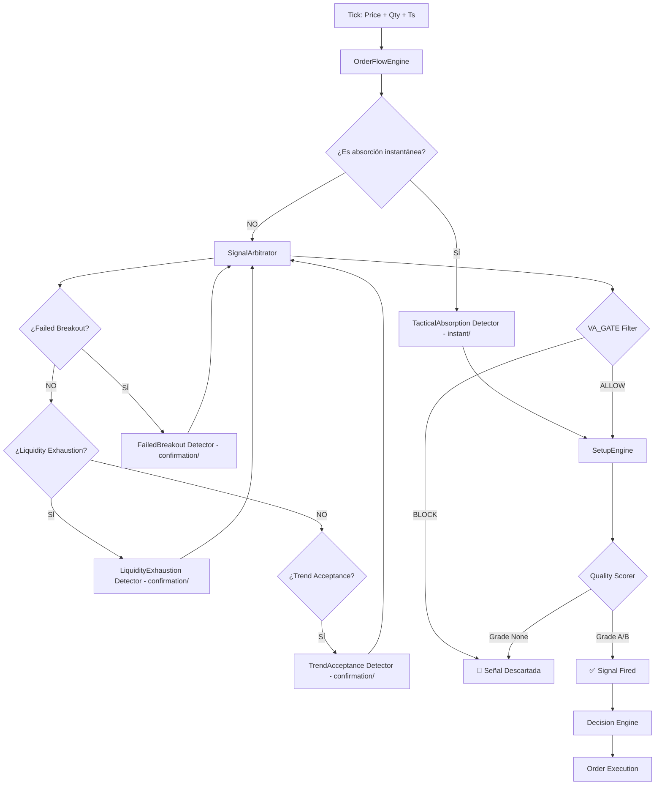

# 🗺️ Architecture Map — Casino-V3 (Post-Refactor Junio 2026)

> **Propósito:** Este documento existe para que **nunca más te pierdas** cuando estés "stuck" optimizando.
> Si no sabes qué parámetro tocar, este mapa te dirá exactamente qué archivo abrir y en qué línea mirar.
>
> **Última actualización:** Junio 2026 (Refactor: OrderFlowEngine + Instant/Confirmation)

---

## 🏛️ Flujo de una Señal (De Tick a Orden)

**Explicación rápida:**
1.  **OrderFlowEngine:** Calcula 18 features (CVD, z-scores, absorption). **NO decide.** Solo calcula.
2.  **TacticalAbsorption:** Es **instantáneo**. Vive en `decision/scenarios/instant/`. Bypasea el SignalArbitrator. Si detecta absorción → señal directa a SetupEngine.
3.  **SignalArbitrator:** Recibe señales de los otros 3 detectores (FB/LE/TA). Los filtra por VA_GATE y resuelve conflictos.
4.  **VA_GATE:** Bloquea mean-reversion en trending, permite trend-following.
5.  **Quality Scorer:** Filtra señales por calidad (A/B = pasa, None = se descarta).
6.  **SetupEngine:** Convierte señal en orden con brackets TP/SL.

---

## 📁 Mapa de Archivos (¿Dónde está cada cosa?)

| Componente | Archivo | Líneas Clave | ¿Qué hace? |
|------------|---------|--------------|------------|
| **OrderFlowEngine** | `core/order_flow/engine.py` | 1-330 | Calcula 18 features (CVD, velocity, concentration z-score, noise z-score, absorption score v2). **NO genera señales.** |
| **TacticalAbsorption** | `decision/scenarios/instant/tactical_absorption.py` | 1-200 | Detector **instantáneo** de absorción con CVD divergente. **Bypasea SignalArbitrator.** |
| **FailedBreakout** | `decision/scenarios/confirmation/failed_breakout.py` | 1-174 | Detecta breakouts de VA con delta divergente → re-entrada. |
| **LiquidityExhaustion** | `decision/scenarios/confirmation/liquidity_exhaustion.py` | 1-171 | Detecta múltiples tests con delta declinante. |
| **TrendAcceptance** | `decision/scenarios/confirmation/trend_acceptance.py` | 1-246 | Detecta breakout + CVD confirm + pullback. |
| **SignalArbitrator** | `decision/signal_arbitrator.py` | 26-201 | Antes ScenarioManager. Filtra señales de los 3 escenarios de confirmación, aplica VA_GATE, resuelve conflictos por prioridad × score. |
| **QualityScorer** | `decision/engine/quality_scorer.py` | 1-150 | Evalúa calidad de señal (A/B/None) con 5 factores ponderados. |
| **SetupEngine** | `decision/engine/setup_engine.py` | 1-300 | Convierte señal en orden con TP/SL dinámicos por perfil. |
| **ProfileManager** | `decision/engine/profile_manager.py` | 1-120 | Resuelve perfil de cada símbolo (cluster) y devuelve parámetros. |
| **CoinProfiles** | `config/coin_profiles.py` | 1-500 | **Aquí están los parámetros de cada cluster.** |

---

## 🎚️ Mapa de Parámetros (¿Dónde ajustar cada threshold?)

### **Si quieres ajustar la entrada de...**

| Escenario | Parámetro | Archivo | Línea aprox. | Valor típico | Efecto de subirlo |
|-----------|-----------|---------|--------------|--------------|-------------------|
| **TacticalAbsorption** | `z_score_min` | `config/coin_profiles.py` | por perfil | 1.5-3.0 | Más filtros, menos señales, más calidad |
| **TacticalAbsorption** | `absorption_score_min` | `config/coin_profiles.py` | por perfil | 0.5-0.7 | Exige mayor absorción institucional |
| **FailedBreakout** | `min_break_distance_pct` | `config/coin_profiles.py` | por perfil | 0.0003 (3 bps) | Exige breakout más claro |
| **FailedBreakout** | `divergence_z` | `config/coin_profiles.py` | por perfil | 0.5-1.0 | Exige mayor divergencia de CVD |
| **LiquidityExhaustion** | `min_tests` | `config/coin_profiles.py` | por perfil | 3-5 | Exige más tests del nivel |
| **LiquidityExhaustion** | `declining_threshold` | `config/coin_profiles.py` | por perfil | 0.7 | Exige mayor declinación de delta |
| **TrendAcceptance** | `cvd_confirmation_threshold` | `config/coin_profiles.py` | por perfil | 2.0-5.0 | Exige mayor confirmación de CVD |
| **TrendAcceptance** | `pullback_bps` | `config/coin_profiles.py` | por perfil | 10-20 bps | Pullback más profundo para entrada |

### **Si quieres ajustar la salida (TP/SL)...**

| Parámetro | Archivo | Línea | Valor típico | Efecto |
|-----------|---------|-------|--------------|--------|
| `tp_pct` | `config/coin_profiles.py` | por perfil | 0.024 (2.4%) | Take Profit dinámico |
| `sl_pct` | `config/coin_profiles.py` | por perfil | 0.025 (2.5%) | Stop Loss dinámico |
| `break_even_trigger_pct` | `config/trading.py` | UNIVERSAL_EXIT_RULES | 0.80 (80% del camino) | Cuándo mover SL a BE |
| `time_decay_seconds` | `config/trading.py` | UNIVERSAL_EXIT_RULES | 7200 (2h) | Cuándo comprimir brackets |

### **Si quieres ajustar el filtrado por régimen (VA_GATE)...**

| Parámetro | Archivo | Línea | Valor típico | Efecto |
|-----------|---------|-------|--------------|--------|
| `integrity_threshold` | `config/coin_profiles.py` | por perfil | 0.15 | Threshold de VA maturity |
| `block_in_trending` | `config/coin_profiles.py` | por perfil | [tactical_absorption, failed_breakout, liquidity_exhaustion] | Setups bloqueados en trending |
| `allow_in_trending` | `config/coin_profiles.py` | por perfil | [trend_acceptance] | Setups permitidos en trending |

---

## 🏷️ Nombres Reales vs Nombres en Código

| Nombre en Código | Nombre Antiguo | Lo que realmente es | ¿Por qué el nombre engañoso? |
|------------------|----------------|---------------------|------------------------------|
| **OrderFlowEngine** | `PressureEngine` | `OrderFlowEngine` | "Pressure" sugería decisión. **Renombrado en Junio 2026.** Ahora es honesto: calcula order flow. |
| **SignalArbitrator** | `ScenarioManager` | `SignalArbitrator` | "Manager" sugería gestión. **Renombrado en Junio 2026.** Ahora es honesto: arbitra señales. |
| **QualityScorer** | (sin cambios) | `QualityFilter` | No "evalúa calidad", filtra señales binariamente (pasa/no pasa). |
| **SlimExitEngine** | (sin cambios) | `PassiveBracketCompressor` | No "sale" activamente, comprime brackets OCO pasivamente. |
| **VA_GATE** | (sin cambios) | `RegimeFilter` | No es un "gate" físico, es un filtro de régimen basado en Value Area maturity. |

---

## 🧪 Los 4 Escenarios AMT (Estado Actual)

| Escenario | Archivo | Tipo | Priority | ¿Tiene Edge? | Notas |
|-----------|---------|------|----------|--------------|-------|
| **TacticalAbsorption** | `decision/scenarios/instant/tactical_absorption.py` | Instantáneo | N/A (bypass) | ✅ SÍ (en todos los perfiles) | El más consistente. Bypasea SignalArbitrator. |
| **FailedBreakout** | `decision/scenarios/confirmation/failed_breakout.py` | Confirmación | 50 | ⚠️ Depende del perfil | Funciona bien en THIN_VOLATILE (XRP). |
| **LiquidityExhaustion** | `decision/scenarios/confirmation/liquidity_exhaustion.py` | Confirmación | 100 | ⚠️ Depende del perfil | Edge en LTC, débil en DOGE. |
| **TrendAcceptance** | `decision/scenarios/confirmation/trend_acceptance.py` | Confirmación | 30 | ✅ SÍ (en trending) | Único permitido en downtrend por VA_GATE. |

**Nota arquitectónica:**
- **instant/**: Escenarios que bypassan el SignalArbitrator (latencia crítica).
- **confirmation/**: Escenarios que pasan por SignalArbitrator (VA_GATE + arbitraje).

---

## 🔧 Debugging Rápido (Cuando estés "stuck")

### **Síntoma: "No genera señales en LTC"**
1.  Abre `decision/scenarios/confirmation/trend_acceptance.py`.
2.  Busca la línea 80 (`cvd_confirmation_threshold`).
3.  Si el valor es > 4.0, bájalo a 2.0-2.5.
4.  Corre backtest de nuevo.

### **Síntoma: "Genera demasiadas señales y todas pierden"**
1.  Abre `config/coin_profiles.py`.
2.  Busca el perfil de LTC (`MID_LIQUID`).
3.  Sube `z_score_min` de 2.0 a 2.5-3.0.
4.  Sube `absorption_score_min` de 0.5 a 0.6-0.7.

### **Síntoma: "Solo genera LONGs en downtrend"**
1.  Abre `config/coin_profiles.py`.
2.  Busca la sección `va_gate` del perfil.
3.  Verifica que `trend_acceptance` esté en `allow_in_trending`.
4.  Verifica que `integrity_threshold` sea 0.15 (no 0.50).

### **Síntoma: "Los TP nunca se alcanzan"**
1.  Abre `config/coin_profiles.py`.
2.  Busca `tp_pct` en el perfil.
3.  Si es > 0.03 (3%), bájalo a 0.024 (2.4%).
4.  O revisa `config/trading.py` para ver si el exit engine está comprimiendo demasiado rápido.

---

## 📊 Perfil de Clusters (Taxonomía Actual)

| Cluster | Símbolos | Características | Parámetros Clave |
|---------|----------|-----------------|------------------|
| **MEGA_LIQUID** | ADA, ARB, NEAR | Libros gruesos, bajo spread | `z_score_min=3.0`, `book_bucket_pct=0.0` |
| **MAJOR_LIQUID** | SOL | Liquidez alta, velocidad media | `z_score_min=2.0`, `book_bucket_pct=0.0` |
| **MID_LIQUID** | LTC, AVAX, OP, APT, BNB, LINK | Liquidez media, volatilidad media | `z_score_min=2.0`, `cooldown=180s` |
| **THIN_VOLATILE** | XRP, DOGE | Libros delgados, alto ruido | `z_score_min=1.5`, `book_bucket_pct=0.10` |
| **ILLIQUID_SPEC** | BTC, ETH | Libros gruesos pero lentos | `z_score_min=2.5`, `volume_min_usd=500000` |

**Nota:** `concentration_min` y `noise_max` **YA NO EXISTEN**. Fueron eliminados en Junio 2026. Solo usa `z_score_min`.

---

## 📝 Historial de Cambios de Arquitectura

- **2026-06-27 (Refactor Profundo):**
  - Renombrado: `PressureEngine` → `OrderFlowEngine`.
  - Eliminado: Código legacy (`concentration_min`, `noise_max`, `absorption_score`).
  - Reestructurado: `decision/scenarios/` → `instant/` + `confirmation/`.
  - Actualizado: Este documento refleja la arquitectura limpia.
- **2026-06-27:** Git Flow establecido: `main` (santuario), `dev-<versión>` (oficina), `feat-<experimento>` (laboratorio).
- **2026-06-25:** VA_GATE selectivo por setup_type implementado.
- **2026-06-24:** V11 SlimExitEngine (salidas pasivas, sin `close_position`).
- **2026-06-22:** 8.9 Data Feed Revamp (UNION ALL, 138x speedup).

---

## 🎯 Regla de Oro

> **"Si no puedes encontrar el parámetro que buscas en este mapa, es porque no está documentado. Ábrelo, encuéntralo, y agrégalo para el próximo. Y si cambias la arquitectura, ACTUALIZA ESTE ARCHIVO antes de commitear."**
