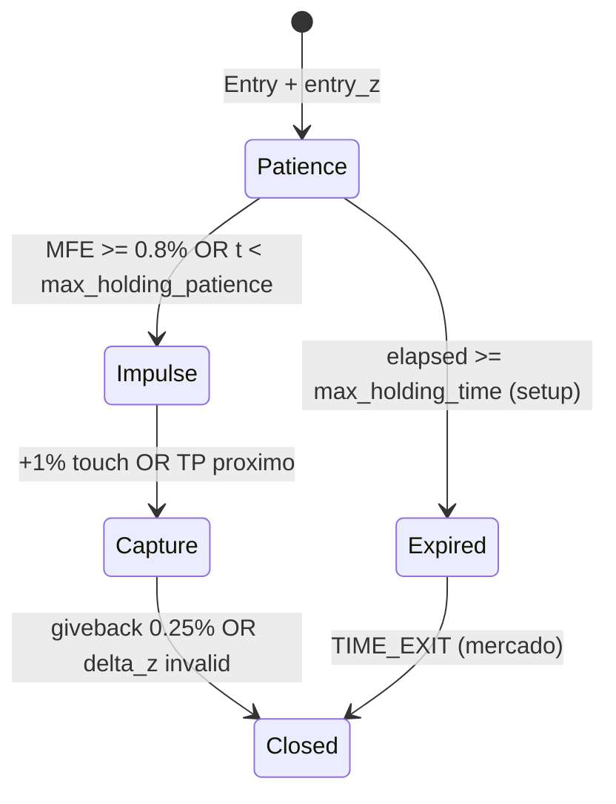

# Análisis Académico de Salidas — Trayectoria Post-Señal (Audit) → Diseño de Pilares Demo/Live

**Proyecto:** Casino-V3 · Rama `v8.1-unified-decision-dna`
**Fecha de corrida:** 2026-05-21
**Protocolo:** `.agent/workflows/generalized-edge-audit.md` (lotes B)
**Artefactos:** `logs/edge_audit_20260521/`, `data/historian.db` (98 señales, 27 834 `price_samples`)

---

## 0. Corrección de enfoque (lectura obligatoria)

**El modo `--audit` ignora por diseño el Exit Engine** (SlimExit, scale-out, trailing, delta táctico). No hay trades ejecutados en esta corrida.

Por tanto **este documento NO evalúa** si SlimExit “funciona”. Estudia la **física del movimiento después de la señal**:

- ¿Cuánto tarda el precio en desarrollar el impulso certificado (~1 %)?
- ¿Cuándo termina ese impulso (giveback, estancamiento)?
- ¿Qué metadato ya emite el **Setup** (`max_holding_time`, `z_score_entry`) y sirve como **input** para rediseñar pilares en demo/live?

La matriz Net Taker del auditor es una **herramienta de simulación** (TP/SL simétricos sobre `price_samples`), no el PnL del motor de salidas en producción.

---

## 1. Marco metodológico

### 1.1 Qué mide audit vs qué diseñamos

| Dimensión | Modo `--audit` | Objetivo del diseño de salidas |
|-----------|----------------|--------------------------------|
| SlimExitEngine | **Apagado** | Diseñar pilares que **repliquen** la física observada |
| OCO TP/SL estructural | No se ejecuta; distancias sí están en metadata | Brackets = techo/piso; no sustituyen “fin de impulso” |
| `price_samples` | Muestreo ~30 s (`AUDIT_SAMPLING_FREQ`) | Cronometría del movimiento (resolución ±30 s) |
| `z_score_entry` | Snapshot en el entry | Baseline para **delta invalidation**; falta serie `z(t)` |

### 1.2 Preguntas guía (las de esta sesión)

1. ¿El **`max_holding_time` del setup** es un buen candidato a pilar temporal?
2. ¿Con los datos se ve **cuándo termina** el movimiento al ~1 %?
3. ¿Analizar **invalidación por delta** (u otra) ayuda a rehacer un pilar (p. ej. Pilar 4 DI)?

---

## 2. Respuestas empíricas (historian 2026-05-21, n=98)

Script: análisis offline sobre `signals` + `price_samples` (horizonte 4 h por señal).

### 2.1 `max_holding_time` del Setup — ¿buen pilar temporal?

**En código hoy no son “bars”, son segundos:**

```262:262:decision/setup_engine.py
                "max_holding_time": 3600 if scenario in ["TacticalAbsorptionV2", "absorption_reversal"] else None,
```

- **Corrida 2026-05-21:** 93 / 98 señales tenían `max_holding_time = 3600` (1 h). **Recalibrado** a 14 400 s — ver `config.trading.ABSORPTION_MAX_HOLDING_SEC`.
- El campo está en **metadata del signal**; **ningún módulo lo consume** aún (ni SlimExit ni OrderManager). Es promesa de diseño, no comportamiento live.

**¿Encaja con el movimiento al 1 %?**

| Métrica | Valor |
|---------|-------|
| Señales que **alguna vez** tocan +1 % favorable en 4 h | 36 / 98 (37 %) |
| Mediana de tiempo hasta **primer** +1 % | **5 499 s** (~1,5 h) |
| Tocan +1 % **antes** de 3600 s | 9 / 36 (25 %) |
| Tocan +1 % **después** de 3600 s | **26 / 35** (74 %) de las que tienen `max_holding_time` |

**Veredicto:** Usar **tal cual** el `max_holding_time` del setup (3600 s) como pilar de cierre sería **prematuro** para el edge al 1 %: mataría ~3 de cada 4 trades que **sí** llegarían al 1 % si se les deja más aire.

**Sí es buen concepto de pilar** si:

1. El **Setup recalibra** el valor (p. ej. 14 400 s para absorción, o `bars` × timeframe → segundos).
2. El Exit Engine **lee** `position.metadata["max_holding_time"]` (o `DecisionEvent`) en lugar de hardcodear 4 h.
3. Se separan **dos relojes** (ver §2.4): “paciencia estructural” vs “captura post-impulso”.

Si preferís **bars**: hoy no existe en metadata; habría que emitir p. ej. `max_holding_bars: 240` en velas 1m (= 14 400 s), coherente con la ventana de certificación.

---

### 2.2 ¿Cuándo termina el movimiento al ~1 %?

Dos regímenes distintos en los datos:

#### A) Impulso que **sí** alcanza +1 % (n=36)

| Fase | Hallazgo |
|------|----------|
| **Llegada** | Mediana **5 499 s** hasta primer +1 %; p75 ~11 049 s |
| **Después del +1 %** | Caída ≥0,25 % desde el pico post-touch: mediana **~30 s** (límite de muestreo 30 s) |
| **Lectura** | El impulso “útil” al 1 % es **lento para nacer** y **rápido para agotarse** una vez tocado |

Esto no pide “mantener 4 h **después** del 1 %”; pide **no cerrar antes** del 1 % y luego un pilar de **“fin de impulso”** (giveback / delta), no un timeout largo post-target.

#### B) Estancamiento bajo el 1 % (n=14 con pico 0,7–1,0 %)

- Mediana de pico **0,89 %** — el mercado **casi** entrega el edge y revierte.
- Aquí un pilar temporal largo (4 h) **no ayuda**; hace falta otra lógica (invalidación temprana, SL estructural, o filtro de entrada).

#### C) Nunca llegan a +1 % en 4 h (n=48)

- Mediana de MFE global **0,735 %**.
- El problema es **entrada / régimen** (guardian ya rechazó 2 152 setups), no solo salida.

**Conclusión cinemática:** La ventana de **4 h** en el auditor es el **horizonte para que el trade pueda nacer**; el **fin del movimiento** al 1 %, cuando ocurre, es un evento **corto después del touch** → pilares de salida deben ser **event-driven** (giveback, delta), no solo `TIME_EXIT` fijo al final de 4 h.

---

### 2.3 Invalidación por delta — ¿ayuda a rehacer un pilar?

**Diseño actual (SlimExit Pilar 4)** — lógica correcta en papel:

- Guarda `entry_z` en la posición.
- Cierra si `delta_z = z_now - entry_z` cruza umbral (flujo **revirtió** respecto al absorption entry).
- No usa nivel absoluto de Z (evita disparar contra la tesis de entrada).

**Límite de ESTA corrida audit:** En `historian` solo tenemos **`z_score_entry` en metadata**, no serie temporal de `z(t)`. **No se puede** validar empíricamente cuántas veces el delta habría cerrado antes/después del +1 % con los datos actuales.

**Proxies de precio que sí salen del audit:**

| Proxy | n | Mediana | Uso para diseño |
|-------|---|---------|-----------------|
| Giveback ≥0,25 % desde pico **después** de tocar +1 % | 36 | ~30 s | Pilar “**MOVE_COMPLETE**” (precio) |
| Giveback desde pico (peak ≥0,5 %) | 62 | 0,55 % | Filtro de agotamiento |
| MAE mediana **antes** del primer +1 % | 35 | ver script | “Breathing room” — DI no debe disparar aquí |

**Propuesta de rearme del Pilar 4 (delta invalidation):**

```
Estado 1 — PATIENCE (hasta que max_holding_time o MFE < 0.5%):
  → DI desarmado (solo SL estructural OCO)

Estado 2 — IMPULSE (MFE >= 0.8% o precio tocó +1%):
  → DI armado: delta_z > threshold
  → OR giveback desde pico >= 0.25% (confirmación precio)

Estado 3 — CAPTURE:
  → Priorizar cierre táctico (taker si hace falta) en giveback o DI;
     no esperar TP OCO lejano (~1.8% dinámico)
```

**Para validar delta de verdad:** En modo audit, muestrear `micro_z` cada 30 s en `price_samples` o tabla `micro_state_samples`. Sin eso, el pilar delta sigue siendo **hipótesis** calibrada solo con `entry_z`.

**`entry_z` en esta muestra:** Mediana |z| ≈ 0,23 (los que llegan a 1 %) vs 0,17 (los que no) — señal débil; el régimen post-entry importa más que el Z en el tick de entrada.

---

### 2.4 Modelo de dos relojes (recomendación de arquitectura)



| Reloj | Fuente | Valor sugerido (datos 2026-05-21) |
|-------|--------|-----------------------------------|
| **Paciencia** | Setup `max_holding_time` **recalibrado** | **≥ 14 400 s** (no 3600) para TacticalAbsorptionV2 |
| **Fin de impulso** | Trayectoria + delta | Giveback 0,25–0,35 % post-1 % o DI con `entry_z` |
| **Techo OCO** | TP dinámico AMT | Puede quedar lejos; no confiar solo en él para el 1 % certificado |

---

### 1.2 Mandato operativo (memory + gotchas)

- **Taker-only (0,12 % roundtrip):** La certificación comercial se juzga con Net Taker; el SlimExitEngine prioriza **Maker-Join** en salidas tácticas → riesgo de no capturar el edge si las salidas parciales no alcanzan el target simétrico certificado.
- **Stagnation profit-aware:** No cerrar ganadores por estancamiento (gotcha #3); cualquier pilar de “time decay” debe distinguir MFE positivo vs trade muerto.
- **ETH excluido** del universo live certificado (2026-05-20); esta corrida lo **confirma**.

### 1.3 Suficiencia de datos (esta corrida)

| Métrica | Objetivo protocolo | Resultado 2026-05-21 | Veredicto |
|---------|---------------------|----------------------|-----------|
| Señales totales | ≥ 300 | **98** | **INSUFICIENTE** para SE ≤ ±2,8 % |
| Señales por moneda | ≥ 10 | 5 monedas OK; 4 con n &lt; 5; **XRP = 0** | Parcial |
| `decision_traces` | — | 2 662 (2 152 rechazos `REGIME_ALIGNMENT_V3`) | Guardian muy restrictivo en alts |

**Conclusión de muestra:** Los hallazgos de **forma** (timeouts vs ventana, targets 1,0–1,2 %, ETH tóxico) son válidos; los magnitudes absolutas de expectancia deben **re-validarse** tras una corrida con n ≥ 300 o repetición de lotes solo en monedas certificadas.

---

## 3. Inventario de la corrida (referencia)

### 2.1 Ejecución (Opción B)

```
Lote 1: LTC, XRP, DOGE     (×3 paralelo)  ~2,5 min
Lote 2: LINK, ADA, SUI     (×3 paralelo)  ~5 min
Lote 3: BNB, AVAX          (×2 paralelo)  ~24 min
Solo:   ETH                ~1 h 44 min
Solo:   SOL                ~18 min
Merge → data/historian.db
```

### 2.2 Señales por moneda

| Símbolo | n | Notas |
|---------|---|--------|
| BNBUSDT | 37 | Mayor densidad; perfil DEFAULT en SlimExit hoy |
| ETHUSDT | 21 | BLUE_CHIP; edge negativo en 4h |
| SOLUSDT | 13 | HIGH_BETA en config |
| SUIUSDT | 11 | DEFAULT (sin perfil dedicado) |
| AVAXUSDT | 10 | HIGH_BETA |
| LTC, LINK | 2 | LOW_N |
| DOGE, ADA | 1 | LOW_N |
| XRPUSDT | 0 | Sin señales tras guardian |

### 2.3 Resumen global (`setup_edge_auditor.py --window 14400`)

| Métrica | Valor |
|---------|-------|
| Señales | 98 |
| Decididas (W+L) | 60 |
| **Timeouts (dinámico TP/SL)** | **37 (37,8 %)** |
| WR global (decididos) | 50,0 % |
| Avg TP distancia | **1,847 %** |
| Avg SL distancia | **1,224 %** |
| Gross expectancy | +0,2845 % |
| **Net Taker** | **+0,1645 %** ✅ (agregado) |

### 2.4 Setup breakdown (MFE / MAE)

| Setup | n | Avg MFE | Avg MAE | Ratio | Veredicto auditor |
|-------|---|---------|---------|-------|-------------------|
| TacticalAbsorptionV2 | 93 | 1,007 % | 0,877 % | 1,15 | WATCH (+0,20 % Exp dinámico) |
| failed_breakout | 2 | 1,107 % | 0,706 % | 1,57 | LOW_N |
| liquidity_exhaustion | 3 | 0,725 % | 0,724 % | 1,00 | LOW_N |

**Lectura para exits:** Hay **~1 % de MFE medio** con **~0,88 % de MAE** antes de gestión. Los brackets dinámicos (~1,8 % TP / ~1,2 % SL) están **más lejos** que el sweet spot uniforme (0,9/1,0 %). El motor de salida debe **no asumir** que el OCO alcanzará TP rápido; la ventana de **4 h** es parte del edge.

### 2.5 L2 (muro de liquidez)

| Categoría | Trades | MFE/MAE |
|-----------|--------|---------|
| High Wall (&gt;2,0) | 74 | 1,15 |
| Balanced (1,0–2,0) | 5 | 2,50 |
| Thin Wall (&lt;1,0) | 14 | 0,59 |

En esta muestra, High Wall **no supera 1,2** → no certifica filtro L2 como obligatorio; sí confirma que Thin Wall degrada estructura.

---

## 4. Matriz Net Taker por moneda (simulación auditor — no es SlimExit)

Solo monedas con **n ≥ 5** en la matriz Step 5. Fee: **−0,12 %** fijo (taker roundtrip). ✅ = Net Taker &gt; 0.

### 3.1 Ventana 4 h (14 400 s) — **referencia para live**

| Moneda | n | Mejor target | WR % | Net Taker % | TO % @ 1,2 % | vs baseline 2026-05-20 |
|--------|---|--------------|------|-------------|--------------|----------------------|
| **SUIUSDT** | 11 | 1,0–1,2 % | 63,6 | **+0,15 → +0,21** | 0 % | Certificado (alineado) |
| **SOLUSDT** | 13 | 1,2 % | 70,0 | **+0,25** | 23 % | Certificado (~+0,28) |
| **BNBUSDT** | 37 | 1,2 % | 75,0 | **+0,07** | 68 % @ 1,2 % | Certificado (~+0,11); más TO |
| **AVAXUSDT** | 10 | 1,2 % | 60,0 | **+0,12** | 0 % | Certificado (~+0,12) |
| **ETHUSDT** | 21 | — | — | **siempre &lt; 0** | 81 % TO @ 1,2 % | EXCLUDED (confirmado) |

### 3.2 Efecto de acortar la ventana (lección para TIME_EXIT mínimo)

| Moneda | 1 h: TO% @ 1,0 % | 4 h: Net @ 1,2 % |
|--------|------------------|------------------|
| BNB | 89 % | +0,07 % |
| ETH | 100 % | −0,35 % |
| SOL | 38 % @ 1 h → mejora en 4 h | +0,25 % |
| SUI | 73 % @ 1 h → 0 % TO en 4 h | +0,21 % |

**Teorema operativo (empírico):** Salidas o brackets que **fuerzan resolución &lt; 2 h** destruyen expectancia en absorción AMT, aunque el WR a targets pequeños (0,3–0,5 %) parezca aceptable.

### 3.3 Uniform grid vs TP/SL dinámico (TacticalAbsorptionV2, n=93)

| TP/SL uniforme | Net Taker | Timeouts |
|----------------|-----------|----------|
| 0,3–0,5 % | Negativo | 0–3 |
| 0,9/1,0 % | ~−0,10 % | 21–26 |
| 1,0/1,0 % | −0,12 % | 31 |

Con TP/SL **dinámicos** (distancia real ~1,8 % / ~1,2 %): Exp **+0,20 %** pero **37 timeouts** — el precio **sí** se mueve a favor (~1 % MFE) pero **no** alcanza el bracket lejano en 4 h simulados en muchos casos.

**Requisito para Exit Engine:** Separar tres horizontes:

1. **Bracket OCO (estructural):** distancia AMT al entry (puede ser &gt; 1,5 %).
2. **Horizonte mínimo de holding:** ≥ **4 h** salvo invalidación (delta / SL).
3. **Salida táctica opcional:** no debe realizar **net** por debajo del target certificado (1,0–1,2 %) en monedas LIVE sin escala explícita de “capture parcial”.

---

## 5. Implicaciones para SlimExit (diseño, no evaluación)

### 4.1 Estado del código (V10.2)

Archivo: `croupier/components/slim_exit_engine.py`

| Pilar | Función | En perfiles live relevantes |
|-------|---------|----------------------------|
| 1 Scale-out | Cierre parcial en `at_atr` | HIGH_BETA: sí (SOL, AVAX); BNB/SUI: **DEFAULT off** |
| 2 Break-even | Mueve SL a entry | HIGH_BETA / BLUE_CHIP: sí |
| 3 Trailing | Sigue tendencia | HIGH_BETA / BLUE_CHIP: sí |
| 4 Delta invalidation | Cierre por flujo tóxico | HIGH_BETA / BLUE_CHIP: sí |
| **5 Time / max hold** | — | **NO EXISTE** (objetivo memory #3 pendiente) |

`config/trading.py` → `ASSET_EXIT_PROFILES`:

| Perfil | Activos listados | Certificados en audit |
|--------|------------------|------------------------|
| BLUE_CHIP | BTC, ETH | ETH **excluir** |
| LIQUID_ALT | LTC, XRP, BCH, LINK | LTC/XRP casi sin señales |
| HIGH_BETA | SOL, AVAX, DOT | SOL, AVAX ✅ |
| DEFAULT | fallback | **BNB, SUI** caen aquí (pilares off) |

**Hallazgo de configuración:** Las monedas **más rentables en la matriz 4h (BNB, SUI)** no tienen perfil de salida activo → en demo/live solo dependen del OCO estático, sin gestión táctica alineada al edge.

### 4.2 Tensiones diseño ↔ datos

| # | Tensión | Evidencia | Acción propuesta |
|---|---------|-----------|------------------|
| T1 | Sin **TIME_EXIT 4h** | 37 timeouts en audit; memory roadmap | Nuevo **Pilar 5: Temporal Exit** en SlimExitEngine |
| T2 | Maker en salidas vs **Taker mandate** | Net certificado a 0,12 % taker | Salida temporal y SL de emergencia: **taker permitido**; tácticas maker solo si `capture ≥ min_edge` |
| T3 | Scale-out prematuro | MFE ~1 %, TP bracket ~1,8 % | `at_atr` ≥ distancia al **min certified target** (ej. 1,2 % / ATR) |
| T4 | BNB/SUI en DEFAULT | Pilares deshabilitados | Perfil `CERTIFIED_ALT` o extender HIGH_BETA |
| T5 | ETH en BLUE_CHIP | Net negativo 4h | Gate pre-trade: **no abrir** ETH en live |
| T6 | Trailing en rango | Absorción mean-reversion | Trailing **off** o activación muy tardía en `IN_VALUE` |
| T7 | Audit ≠ producción | 0 trades esta corrida | Fase 2: `strategy-audit.md` con SlimExit **on** (mismo dataset) |

---

## 6. Especificación objetivo: pilares demo/live (derivada de §2)

### 5.1 Principios (no negociables)

1. **No modificar SetupEngine** (umbrales, guardians de entrada) en esta fase — solo ejecución y salida.
2. **Profit-aware:** Si `unrealized_pnl_pct > 0` y `MFE desde entry ≥ 0,5 × target_cert`, prohibido cerrar por “stagnation/time” con pérdida de upside (gotcha #3).
3. **Horizonte mínimo:** `MIN_HOLD_SEC = 14400` por defecto para `TacticalAbsorptionV2` (configurable por perfil).
4. **Universo live v1:** `BNBUSDT`, `SOLUSDT`, `SUIUSDT`, `AVAXUSDT` — excluir `ETHUSDT`.

### 5.2 Pilar 5 propuesto — Temporal & bracket alignment

```yaml
# Propuesta de config (añadir a ASSET_EXIT_PROFILES o GLOBAL)
temporal_exit:
  enabled: true
  max_hold_sec: 14400          # 4h — alineado con SETUP_WINDOWS continuation
  soft_warning_sec: 10800      # 3h — solo log / telemetría
  exit_reason: TIME_EXIT
  min_profit_to_force_pct: null  # null = cerrar a mercado al timeout (taker)
  profit_aware: true           # si en profit > X, opcional: trailing en vez de cierre dura
```

**Comportamiento:**

- Si `elapsed ≥ max_hold_sec` y TP OCO no filled → `OrderManager` ejecuta `TIME_EXIT` (market, taker).
- Si posición en **ganancia** &gt; `certified_target × 0.8` al timeout → preferir **limit join** una vez antes de market (reducir fee).
- Registrar en UDT: `exit_trigger=TIME_EXIT`, `held_sec`, `mfe_at_exit`, `distance_to_tp_pct`.

### 5.3 Perfil propuesto `CERTIFIED_ALT` (BNB, SUI)

| Pilar | Setting | Justificación |
|-------|---------|---------------|
| scale_out | off o `at_atr` muy alto | SUI 0 % TO en 4h — dejar correr |
| break_even | `at_atr` cuando precio ≥ 0,6 × target | Proteger sin cortar winners |
| trailing | **disabled** en IN_VALUE | Evitar salida tendencial en reversión |
| delta_invalidation | on, z=5.0 | Cortar flujo tóxico post-entry |
| temporal_exit | on, 14400 s | Capturar edge 1,0–1,2 % |

### 5.4 Ajuste HIGH_BETA (SOL, AVAX)

- Mantener delta invalidation.
- Scale-out: solo si `fraction` deja **≥ 50 %** de la posición con TP OCO al **1,2 %** simétrico.
- `trailing.activation_atr` ≥ umbral que equivale a **~1,0 %** de movimiento desde entry (evitar activación a 0,3 %).

### 5.5 ETH / XRP

| Activo | Política demo/live |
|--------|-------------------|
| ETH | **Blacklist** en `MultiAssetManager` o gate explícito |
| XRP | Investigar 0 señales (guardian); no habilitar live hasta n ≥ 10 en audit |

---

## 7. Comparativa con baseline certificado (2026-05-20)

| Moneda | Baseline Net @ 1,2 % (4h) | Esta corrida @ 1,2 % (4h) | Δ muestra |
|--------|---------------------------|---------------------------|-----------|
| BNB | +0,107 % | +0,075 % | n=37 vs corrida anterior más grande |
| SOL | +0,280 % | +0,249 % | Coherente |
| SUI | +0,080 % | +0,207 % | Mejor; n=11 |
| AVAX | +0,120 % | +0,120 % | Igual |
| ETH | negativo | negativo | Confirmado exclude |

La forma del edge **se sostiene** en 4 monedas; la **potencia estadística** no (98 vs 385 señales del 18-may).

---

## 8. Plan de datos adicionales (antes de codificar)

Para que el cambio de Exit Engine esté **académicamente cubierto**:

| # | Experimento | Workflow / herramienta | Criterio de éxito |
|---|-------------|------------------------|-------------------|
| D1 | Audit con **`micro_z` cada 30 s** en `price_samples` | ✅ implementado — diseño salidas: `docs/plan_exit_edge_auditor.md` | Exit edge auditor (t_stop + barrido reglas) |
| D2 | Recalibrar **`max_holding_time`** en setup (14 400 s) | ✅ `ABSORPTION_MAX_HOLDING_SEC` en `config/trading.py` | Alineado con §2.1 |
| D3 | Backtest **sin** `--audit` (pilares on) | `strategy-audit.md` | PnL real vs cinemática D1 |
| D4 | Ablation: DI solo post-impulso vs siempre | flags SlimExit | Reducir cierres prematuros |
| D5 | Demo testnet 48h, 4 símbolos | live paper | Slippage + Error Recovery = $0 |

**Orden recomendado:** D1 → D2 → D4 (offline) → D3 → D5.

---

## 9. Checklist de implementación (demo/live)

- [ ] Añadir **Pilar 5 `temporal_exit`** en `slim_exit_engine.py` + wiring en `OrderManager` (`TIME_EXIT`).
- [ ] Crear perfil **`CERTIFIED_ALT`** con BNB/USDT y SUI/USDT (formato normalizado en config).
- [ ] Mover ETH fuera de ejecución live (config o guardian de cartera).
- [ ] Parametrizar `max_hold_sec` por `setup_type` (Absorption → 14400).
- [ ] Telemetría UDT: `exit_pillar`, `seconds_held`, `tp_distance_pct`, `mfe_at_exit`.
- [ ] Documentar en `config/trading.py` que salidas tácticas maker son **opcionales**, no base de certificación.
- [ ] Ejecutar D2 y actualizar este doc con tabla “audit vs slim-on”.

---

## 10. Conclusiones ejecutivas

1. **Audit = cinemática del movimiento**, no rendimiento del Exit Engine. El diseño de pilares debe copiar **tiempos y fin de impulso**, no copiar timeouts del auditor TP/SL lejano.
2. **`max_holding_time` del setup** es el **mejor candidato** a pilar temporal **si** se sube de 3600 s → ~14 400 s y se **conecta** en SlimExit; hoy 3600 s **contradice** el 74 % de trades que tardan más de 1 h en llegar al 1 %.
3. El movimiento al 1 % **termina pronto después de tocarse** (giveback rápido en muestreo 30 s) → hace falta pilar de **captura / invalidación**, no solo “aguantar 4 h”.
4. **Delta invalidation** es el pilar correcto **conceptualmente**, pero hay que **armarlo después del impulso** y registrar **`z(t)`** en audit para calibrarlo; giveback de precio es el proxy usable ya.
5. Próximo dato: extender audit con `micro_z` en cada `price_sample`; luego backtest **sin audit** para medir interferencia real de pilares.

---

## Referencias internas

- `.agent/memory.md` — baseline 4h, gotcha taker-only, objetivo TIME_EXIT.
- `.agent/workflows/generalized-edge-audit.md` — protocolo fuente.
- `.agent/workflows/strategy-audit.md` — validación con SlimExit activo.
- `croupier/components/slim_exit_engine.py` — implementación actual.
- `config/trading.py` — `ASSET_EXIT_PROFILES`, `PATIENCE_LOCK_GRACE_PERIOD`.
- `utils/setup_edge_auditor.py` — `DEFAULT_WINDOW = 14400`.

---

*Documento generado a partir de la corrida 2026-05-21. Actualizar tras D2/D3 con columna “SlimExit ON”.*
