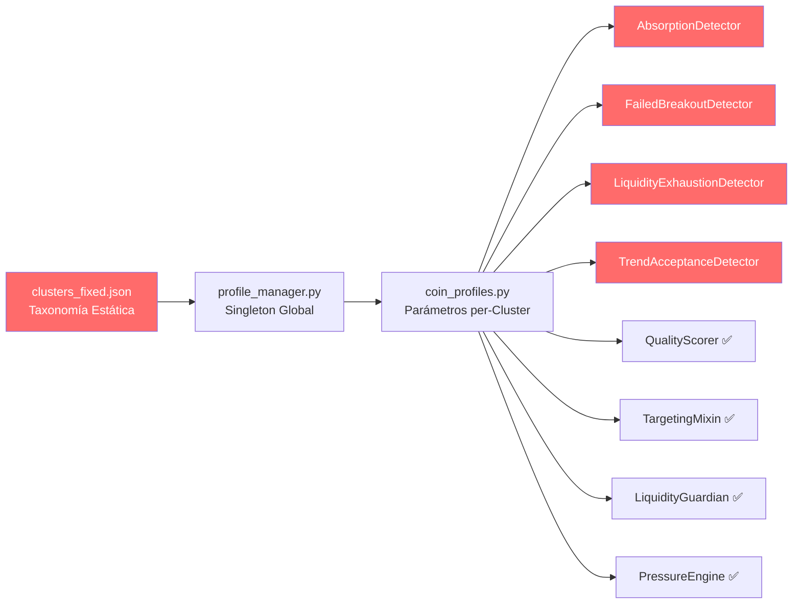

# 🔬 Auditoría del Sistema de Perfiles — Adaptación Per-Cluster a los 4 Escenarios AMT

> **Perspectiva**: Quant Developer Senior — Microestructura de Mercado & Auction Market Theory (AMT)
> **Rama**: `8.7-cluster-improved`
> **Fecha**: 2026-06-08

---

## 1. Resumen Ejecutivo

El sistema de perfiles tiene buena cobertura conceptual. La decisión de diseño **per-cluster** es correcta: monedas con microestructura similar comparten parámetros. Los targets per-scenario (TAV/TA con SL ancho vs FB/LE con SL ajustado) están correctamente estructurados en los perfiles.

**Defecto principal encontrado**:

| Defecto | Severidad | Impacto |
|---------|-----------|---------|
| **D1 — Detectores instanciados con DEFAULT_PROFILE, no con el cluster del símbolo** | 🔴 CRÍTICO | Los 4 detectores usan MID_LIQUID para TODAS las monedas |

Además: **10 parámetros hardcodeados** que deberían leerse del perfil del cluster, un **bug severo** en PressureEngine (umbral de stagnation absoluto), y una **desconexión de nombres** entre TrendAcceptance y el profile.

> [!NOTE]
> - Los targets idénticos entre perfiles son **placeholders** pendientes de rondas de ajuste paramétrico — no son un defecto.
> - Per-regime targets → **roadmap futuro** (la clasificación de régimen aún no es confiable para condicionar targets).

---

## 2. Anatomía del Pipeline de Perfiles



**Nodos en rojo** = ruptura en la cadena. Los detectores (D1-D4) reciben parámetros del `DEFAULT_PROFILE` global (MID_LIQUID), ignorando el cluster asignado a cada símbolo.

**Nodos con ✅** = correctamente parametrizados. QualityScorer, TargetingMixin, LiquidityGuardian y PressureEngine **sí resuelven** el cluster del símbolo en runtime.

---

## 3. Defecto D1 — Detectores con Perfil DEFAULT (No Per-Cluster)

### Root Cause

En [sensor_manager.py:114-136](file:///home/chesterbelle/Casino-V3/core/sensor_manager.py#L114-L136):

```python
# DEFECTO: Se usa el DEFAULT_PROFILE para TODOS los detectores
default_profile = profile_manager.default_profile  # → "MID_LIQUID"
profiles = profile_manager.profiles.get(default_profile, {})

self.scenarios["tactical_absorption"] = AbsorptionDetector(
    self.pressure_engine, profiles.get("sensors", {}).get("absorption_detector")
)
# ... los otros 3 detectores igual
```

Hay **UNA sola instancia** de cada detector que opera sobre TODAS las monedas con los parámetros de MID_LIQUID. El propio código lo reconoce (línea 119):

```python
# SI queremos parámetros por moneda, el detector debe manejar un mapa
# de params internamente. Para esta fase, usamos el perfil por defecto.
```

### ¿Por qué el resto del sistema SÍ funciona?

Los otros componentes resuelven el cluster en runtime:
- **QualityScorer** → `profile_manager.get_quality_scorer_params(symbol)` en cada evaluación
- **TargetingMixin** → `profile_manager.get_target_params(symbol, scenario, regime)` en cada cálculo
- **LiquidityGuardian** → `profile_manager.get_guardian_params(symbol)` en cada check
- **CoinPressureEngine** → `profile_manager.get_sensor_params(symbol, ...)` al crear instancia

Los detectores son **los únicos que NO hacen este lookup**.

### Impacto Cuantitativo

Cuando procesa THIN_VOLATILE (XRP/DOGE), los detectores usan MID_LIQUID:

| Parámetro | MID_LIQUID (usado) | THIN_VOLATILE (debería usar) | Error |
|-----------|-------------------|------------------------------|-------|
| `z_score_min` | 2.0 | **2.5** | -20% más permisivo |
| `concentration_min` | 0.50 | **0.60** | -17% más permisivo |
| `noise_max` | 0.40 | **0.35** | +14% más permisivo |
| `cooldown` (absorption) | 180s | **150s** | +20% más lento |
| `min_break_distance_pct` | 0.0012 | **0.0015** | -20% más permisivo |
| `min_bounce_pct` | 0.0010 | **0.0015** | -33% más permisivo |

> [!IMPORTANT]
> **XRP y DOGE están operando con filtros ~20% más permisivos de lo configurado en su cluster.** Esto contribuye al ruido excesivo en THIN_VOLATILE (4522 señales en Iter 2, Net Taker -0.33%).

Cuando procesa MEGA_LIQUID (según `clusters_fixed.json`: ADA, ARB, NEAR):

| Parámetro | MID_LIQUID (usado) | MEGA_LIQUID (debería usar) | Error |
|-----------|-------------------|----------------------------|-------|
| `z_score_min` | 2.0 | **3.0** | -33% más permisivo |
| `concentration_min` | 0.50 | **0.60** | -17% más permisivo |
| `noise_max` | 0.40 | **0.25** | +60% más permisivo |
| `cooldown` (absorption) | 180s | **300s** | -40% más rápido |

---

## 4. Bug PressureEngine — Stagnation Threshold Absoluto

En [engine.py:79-81](file:///home/chesterbelle/Casino-V3/core/pressure/engine.py#L79-L81):

```python
price_diff = abs(price - self.last_price) if self.last_price > 0 else 0.0
is_high_delta = abs(self.last_state.cvd_velocity) > 0.1
is_price_stagnant = price_diff < 0.10  # ← ABSOLUTO, no porcentual
```

> [!CAUTION]
> El umbral $0.10 es **absoluto**:
> - **BTC** ($68,000): $0.10 = 0.00015% → TODO es "stagnant" → `absorption_score` se infla artificialmente
> - **DOGE** ($0.35): $0.10 = 28.6% → NADA es "stagnant" → `absorption_score` se aplasta a 0
>
> El parámetro `stagnation_floor_pct` **ya existe** en los 5 cluster profiles (valores: 0.12, 0.10, 0.08, 0.15, 0.08) pero esta línea no lo usa.

---

## 5. Inventario de Parámetros Hardcodeados

### 5.1 AbsorptionDetector ([absorption_detector.py](file:///home/chesterbelle/Casino-V3/sensors/absorption/absorption_detector.py))

| Parámetro | Default | ¿Lee del profile? | ¿Debería? |
|-----------|---------|-------------------|-----------|
| `cooldown` | 180.0 | ✅ Sí* | ✅ |
| `level_tolerance_pct` | 0.003 | ❌ **No** | 🔴 **Sí** — books tight (MEGA) necesitan tolerancia menor |
| `z_score_min` | 2.0 | ✅ Sí* | ✅ |
| `volatility_z_max` | 2.5 | ✅ Sí* | ✅ |
| `displacement_z_max` | 3.0 | ✅ Sí* | ✅ |
| `absorption_score_min` | 0.5 | ✅ Sí* | ✅ |

*\* Lee del profile solo en constructor, pero como se instancia con DEFAULT_PROFILE, el valor leído es siempre MID_LIQUID (ver D1).*

### 5.2 FailedBreakoutDetector ([failed_breakout.py](file:///home/chesterbelle/Casino-V3/decision/scenarios/failed_breakout.py))

| Parámetro | Default | ¿Lee del profile? | ¿Debería? |
|-----------|---------|-------------------|-----------|
| `cooldown` | 60.0 | ❌ **No** | 🔴 **Sí** |
| `max_break_age` | 60.0 | ✅ Sí* | ✅ |
| `min_break_distance_pct` | 0.0003 | ✅ Sí* | ✅ |
| `cvd_divergence_threshold` | 0.3 | ✅ Sí* | ✅ |

### 5.3 LiquidityExhaustionDetector ([liquidity_exhaustion.py](file:///home/chesterbelle/Casino-V3/decision/scenarios/liquidity_exhaustion.py))

| Parámetro | Default | ¿Lee del profile? | ¿Debería? |
|-----------|---------|-------------------|-----------|
| `cooldown` | 30.0 | ❌ **No** | 🔴 **Sí** |
| `level_tolerance_pct` | 0.0005 | ❌ **No** | 🔴 **Sí** |
| `min_tests` | 3 | ✅ Sí* | ✅ |
| `declining_threshold` | 0.7 | ✅ Sí* | ✅ |
| `min_bounce_pct` | 0.0003 | ✅ Sí* | ✅ |
| `test_memory_seconds` | 120.0 | ✅ Sí* | ✅ |

### 5.4 TrendAcceptanceDetector ([trend_acceptance.py](file:///home/chesterbelle/Casino-V3/decision/scenarios/trend_acceptance.py))

| Parámetro | Default | ¿Lee del profile? | ¿Debería? |
|-----------|---------|-------------------|-----------|
| `cooldown` | 600.0 | ✅ Sí* | ✅ |
| `cvd_confirmation_threshold` | 5.0 | ✅ Sí* | ✅ |
| `pullback_bps` | 12.0 | ❌ **No** | 🔴 **Sí** |
| `min_breakout_distance_bps` | 20.0 | ❌ **No** | 🔴 **Sí** |

> [!WARNING]
> **Desconexión de nombres**: `coin_profiles.py` declara `pullback_tolerance_pct` y `max_pullback_penetration_pct`, pero el detector usa `pullback_bps` y `min_breakout_distance_bps`. Los parámetros existen en el profile pero **nunca se leen** porque los nombres no coinciden y las unidades son diferentes (pct vs bps).

---

## 6. Contradicción Taxonomía vs Descripciones

| Cluster | Miembros reales (`clusters_fixed.json`) | Descripción en `coin_profiles.py` | Estado |
|---------|----------------------------------------|-----------------------------------|--------|
| MEGA_LIQUID | ADA, ARB, NEAR | "BTC, ETH" | 🔴 Outdated |
| MAJOR_LIQUID | SOL | "SOL, BNB, XRP, DOGE, SUI" | ⚠️ Parcial |
| MID_LIQUID | LTC, AVAX, OP, APT, BNB, LINK | "AVAX, ADA, LINK" | ⚠️ Parcial |
| THIN_VOLATILE | XRP, DOGE | "XRP, DOGE" | ✅ OK |
| ILLIQUID_SPEC | BTC, ETH | "Long-tail" | 🔴 Outdated |

> La clasificación **funcional** vía `profile_manager → clusters_fixed.json` es correcta. Solo los comentarios humanos en `coin_profiles.py` están outdated, lo cual puede causar confusión al hacer rondas de ajuste paramétrico.

---

## 7. Componentes Correctamente Parametrizados ✅

| Componente | Cómo resuelve el cluster | Status |
|------------|--------------------------|--------|
| **QualityScorer** | `profile_manager.get_quality_scorer_params(symbol)` en cada `evaluate_quality()` | ✅ |
| **TargetingMixin** | `profile_manager.get_target_params(symbol, scenario, regime)` en cada `_calculate_targets()` | ✅ |
| **LiquidityGuardian** | `profile_manager.get_guardian_params(symbol)` en cada `check_liquidity_heatmap()` | ✅ |
| **CoinPressureEngine** | `profile_manager.get_sensor_params(symbol, ...)` al crear instancia per-symbol | ✅ |
| **SetupEngineV4** | `coin_profiler.classify(symbol)` → `profile_manager.set_profile(symbol, profile)` | ✅ |

---

## 8. Plan de Acción

### 🔴 Fase 1 — Fix Crítico: Detectores Resuelven Cluster del Símbolo

**Objetivo**: Que cada detector, en su `on_tick()`, resuelva el cluster del símbolo y use los parámetros de ese cluster — NOT the DEFAULT_PROFILE.

**Solución**: Cada detector mantiene un cache `dict[symbol → params]` que se populatea la primera vez que ve un símbolo, usando `profile_manager.get_sensor_params(symbol, sensor_name)`. Esto es per-cluster porque `profile_manager` resuelve symbol → cluster internamente.

**Archivos a modificar**:

#### [MODIFY] [absorption_detector.py](file:///home/chesterbelle/Casino-V3/sensors/absorption/absorption_detector.py)
- Agregar `_cluster_cache: Dict[str, dict]`
- Agregar método `_get_params(symbol)` que resuelve cluster una vez por símbolo
- En `on_tick()`, usar params resueltos para `z_score_min`, `cooldown`, etc.
- Conectar `level_tolerance_pct` al profile

#### [MODIFY] [failed_breakout.py](file:///home/chesterbelle/Casino-V3/decision/scenarios/failed_breakout.py)
- Misma estructura: cache + `_get_params(symbol)`
- Conectar `cooldown` al profile

#### [MODIFY] [liquidity_exhaustion.py](file:///home/chesterbelle/Casino-V3/decision/scenarios/liquidity_exhaustion.py)
- Misma estructura: cache + `_get_params(symbol)`
- Conectar `cooldown` y `level_tolerance_pct` al profile

#### [MODIFY] [trend_acceptance.py](file:///home/chesterbelle/Casino-V3/decision/scenarios/trend_acceptance.py)
- Misma estructura: cache + `_get_params(symbol)`
- Conectar `pullback_bps` y `min_breakout_distance_bps` leyendo `pullback_tolerance_pct` × 10000

#### [MODIFY] [sensor_manager.py](file:///home/chesterbelle/Casino-V3/core/sensor_manager.py#L114-L136)
- Simplificar instanciación: no pasar params al constructor (los detectores hacen su propio lookup en runtime)

---

### 🟠 Fase 2 — Fix PressureEngine Stagnation Bug

**Archivo**: [engine.py:79-81](file:///home/chesterbelle/Casino-V3/core/pressure/engine.py#L79-L81)

Cambiar de umbral absoluto ($0.10) a porcentual usando `stagnation_floor_pct` del profile:
```python
# DESPUÉS:
price_diff_pct = abs(price - self.last_price) / self.last_price if self.last_price > 0 else 0.0
is_price_stagnant = price_diff_pct < self.stagnation_floor_pct
```

Y en `_load_params()`:
```python
self.stagnation_floor_pct = params.get("stagnation_floor_pct", 0.0008) if params else 0.0008
```

---

### 🟡 Fase 3 — Conectar Parámetros Desconectados

Agregar a los profiles de cada cluster los parámetros faltantes:

```python
"absorption_detector": {
    # ... existentes ...
    "level_tolerance_pct": 0.003,  # Adaptar: MEGA 0.002, THIN 0.004
},
"liquidity_exhaustion": {
    # ... existentes ...
    "level_tolerance_pct": 0.0005,  # Adaptar: MEGA 0.0003, THIN 0.0008
    "cooldown": 30.0,               # Adaptar: MEGA 60.0, THIN 20.0
},
"failed_breakout": {
    # ... existentes ...
    "cooldown": 60.0,               # Adaptar: MEGA 120.0, THIN 45.0
},
```

**Archivo**: [coin_profiles.py](file:///home/chesterbelle/Casino-V3/config/coin_profiles.py)

---

### 🟡 Fase 4 — Actualizar Descripciones

Alinear los comentarios en `coin_profiles.py` con la taxonomía real de `clusters_fixed.json` para evitar confusión durante el tuning.

---

## 9. Roadmap Futuro (No Implementar Ahora)

| Item | Razón para Postponer |
|------|---------------------|
| **Per-regime targets** | La clasificación de régimen aún no es confiable. Cuando el regime sensor sea robusto, agregar la clave `"regime"` a los targets (la infraestructura en `profile_manager.py` y `targets.py` ya lo soporta). |
| **Filtro direccional per-cluster** | Deshabilitar TAV LONG en TREND_DOWN para THIN_VOLATILE — depende de régimen confiable |
| **Session-aware VA** | IB duration y VA period per-cluster |
| **Holding time per-cluster** | `max_holding_time` per-cluster en vez de global |

---

## 10. Verificación Post-Implementación

| Check | Cómo Verificar |
|-------|----------------|
| Detectores resuelven cluster | Log `[CLUSTER_PARAMS] DOGEUSDT → THIN_VOLATILE (z_min=2.5)` en primer tick |
| Parámetros diferentes per-cluster | Correr audit en LTC (MID) y DOGE (THIN) — z_score_min diferente en logs |
| Stagnation fix | Correr BTC backtest — absorption_score ya no satura en 0.3 |
| TrendAcceptance wiring | pullback_bps difiere entre MEGA y THIN |
